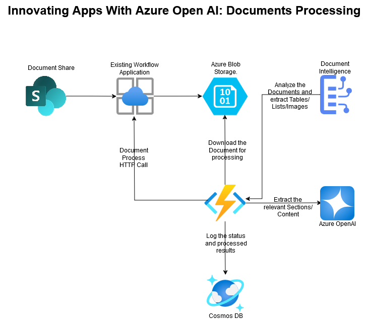
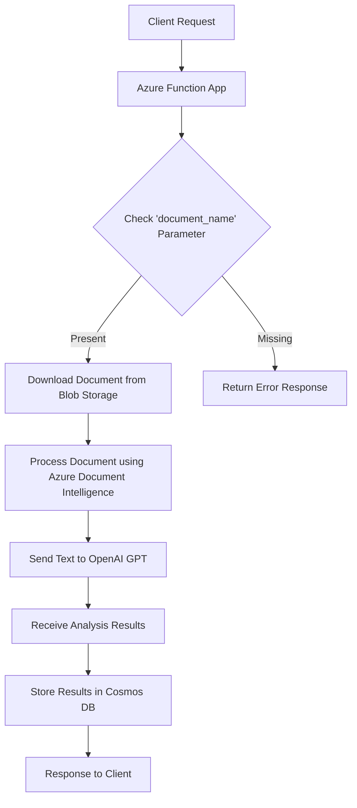

# Azure OpenAI Regulatory Document Processing

This repository contains an Azure Function App designed to process regulatory documents by extracting and analyzing their content using OpenAI's GPT models. The application downloads a document from Azure Blob Storage, processes it using Azure Document Intelligence to extract text and images, sends the text to OpenAI for analysis, and stores the results in Cosmos DB.

## Features

- **Document Download**: Downloads documents from Azure Blob Storage.
- **Document Processing**: Extracts text and images from documents using Azure Document Intelligence.
- **OpenAI Integration**: Uses OpenAI's GPT models to analyze the extracted text.
- **Cosmos DB Storage**: Stores the analysis results in Azure Cosmos DB.

## Architecture



## Wrofk Flow

The following diagram illustrates the application's architecture:



## Prerequisites

- Azure account
- Azure Functions Core Tools
- Python 3.8+
- Azure CLI

## Setup

1. **Clone the repository**:
    ```bash
    git clone https://github.com/azure-data-ai-hub/azure-openai-regulatroy-document-processing.git
    cd azure-openai-regulatroy-document-processing
    ```

2. **Create and activate a virtual environment**:
    ```bash
    python -m venv .venv
    source .venv/bin/activate  # On Windows: .venv\Scripts\activate
    ```

3. **Install the dependencies**:
    ```bash
    pip install -r requirements.txt
    ```

4. **Set up environment variables**:
    Create a `.env` file in the root directory and add the following variables:
    ```env
    COSMOS_DB_URI=<your-cosmos-db-uri>
    COSMOS_DB_KEY=<your-cosmos-db-key>
    BLOB_CONNECTION_STRING=<your-blob-connection-string>
    BLOB_BASE_URL=<your-blob-base-url>
    AZURE_OPENAI_API_ENDPOINT=<your-openai-api-endpoint>
    OPENAI_API_KEY=<your-openai-api-key>
    FORM_RECOGNIZER_ENDPOINT=<your-form-recognizer-endpoint>
    FORM_RECOGNIZER_KEY=<your-form-recognizer-key>
    ```

## Usage

### Running the Function App Locally

1. **Start the Azure Functions local runtime**:
    ```bash
    func start
    ```

2. **Trigger the function**:
    Send an HTTP request to the local endpoint:
    ```bash
    curl -X GET "http://localhost:7071/api/document_processing?document_name=<document_name>"
    ```

### Deploying to Azure

1. **Login to Azure**:
    ```bash
    az login
    ```

2. **Create a resource group** (if not already created):
    ```bash
    az group create --name <resource-group-name> --location <location>
    ```

3. **Create a function app in Azure**:
    ```bash
    az functionapp create --resource-group <resource-group-name> --consumption-plan-location <location> --runtime python --runtime-version 3.8 --functions-version 3 --name <function-app-name> --storage-account <storage-account-name>
    ```

4. **Deploy the function app**:
    ```bash
    func azure functionapp publish <function-app-name>
    ```

## Function Details

### `document_processing`

This HTTP-triggered function processes a document specified by the `document_name` query parameter. It performs the following steps:

1. **Downloads the document** from Azure Blob Storage.
2. **Processes the document** to extract text and images.
3. **Generates a prompt** and sends it to the OpenAI API for analysis.
4. **Stores the analysis results** in Azure Cosmos DB.
5. **Returns the results** as an HTTP response.

## Logging and Error Handling

Logs are written to the Azure Functions log stream and can be viewed in the Azure portal or using the Azure CLI. Error handling is implemented to capture and log exceptions during the document download, processing, and API call steps.

## Contributing

Contributions are welcome! Please open an issue or submit a pull request with your changes.

## License

This project is licensed under the MIT License. See the [LICENSE](LICENSE) file for details.

For any further questions, please refer to the [Azure Functions documentation](https://docs.microsoft.com/en-us/azure/azure-functions/).
